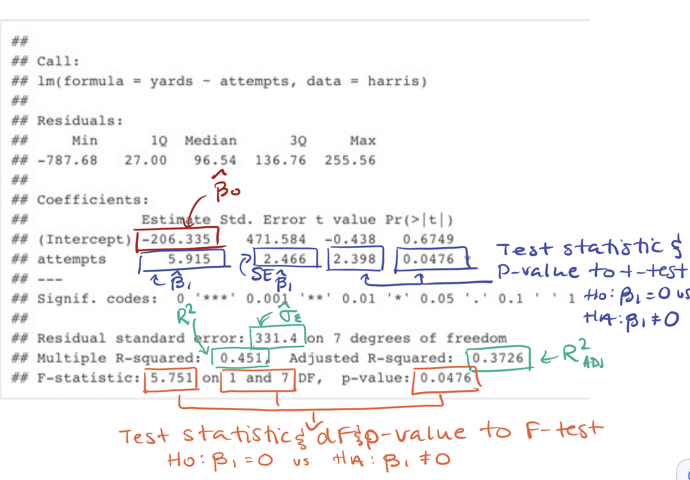

```{r setup, include=FALSE, warning = FALSE}
library(learnr)
knitr::opts_chunk$set(echo = FALSE)
```
<style>

.tt {
  font-family:'Lucida Console', monospace; 
  text-align:center
}

h2 {
  color: darkgreen;
  font-weight: bold
}

h3 {
  color: darkolivegreen;
}

.topicsContainer {
  background-color: #f2f7f6;

}

.topic.current {
  background-color: #e6fcf8;
  border-color: #41ab98;
  border: solid 1px;
  font-weight: bold
}

.band {
  padding-left: 0%
}

.topicsFooter .resetButton {
  font-size: 80%;
}

.btn-primary, .btn-success, .btn-info {
    background-color: darkgreen;
    background-image: none;
    border: none;
}
    .btn-primary:hover, .btn-primary:focus, .btn-primary:active, .btn-primary:focus:active, .btn-success:hover, .btn-success:focus, .btn-success:active, .btn-success:focus:active, .btn-info:hover, .btn-info:focus, .btn-info:active, .btn-info:focus:active {
    background-color: darkolivegreen; }
  .btn-primary:focus:hover, .btn-primary:active:hover, .btn-primary:focus:active:hover, .btn-success:focus:hover, .btn-success:active:hover, .btn-success:focus:active:hover, .btn-info:focus:hover, .btn-info:active:hover, .btn-info:focus:active:hover {
    background-color: darkolivegreen; }
  .btn-primary.disabled, .btn-primary:disabled, .btn-primary.disabled:hover, .btn-primary:disabled:hover, .btn-success.disabled, .btn-success:disabled, .btn-success.disabled:hover, .btn-success:disabled:hover, .btn-info.disabled, .btn-info:disabled, .btn-info.disabled:hover, .btn-info:disabled:hover {
    background-color: darkolivegreen; }
    
.boxed{
 border: 3px solid green ;
 padding: 5px;
}


</style>

## Regression Review

### Linear Relationships

When we say two quantitative variables have a linear relationship, we generally don't mean that every pair of points falls exactly on a line. This is true for variables such as time elapsed and time remaining which are said to have a deterministic relationship. Most variables do not have a deterministic relationship and are influenced by many different factors. For e.g., everyone who is 165 cm tall will not have the same wrist circumference. When we say those variables have a random relationship, what we mean is that if we look at the average of all possible y-values at each particular x in the population, those averages would form a line.

```{r, message = FALSE}
library(tidyverse)
library(ggtext)
set.seed(183)
x.rand <- rep(1:7, each = 50)
y.rand <- 4*x.rand + 2 + rnorm(50*7, 0, 2)
x.mean <- c(1:7)
y.mean <- 4*x.mean + 2
dat <- data.frame(x.rand, y.rand, x.mean, y.mean )

ggplot(dat) +
  geom_point(aes(x=x.rand, y=y.rand)) +
  geom_line(aes(x=x.mean, y=y.mean, col = "red")) +
  geom_point(aes(x=x.mean, y=y.mean, col = "red")) +
  xlab("x variable") +
  ylab("y variable") +
  ggtitle("An x and y variable with an underlying linear relationship") +
  theme_light() +
  theme(legend.position = "none") 
  
```

Here the red dots represent the average y-value of all the points stacked vertically at each x-value. We do not literally expect every point to fall on this straight line. It's a statement about the average behaviour. 

We also won't have all possible (x,y) pairs that ever were or ever will be to make up this population. In practice, we have a small number of points and commonly will not have multiple y-values for each x-value we observe. This means that when we have sample data, we aren't finding these average red dots. What we are doing is observing that the points we have generally fall in the pattern of a line and we do our best to fit the best line through them. 

This "best fitting line" is defined as the line that minimizes the square of the vertical distances between all of the points and the fitted line. We can see a representation of this below:


```{r}
set.seed(435)
x <- runif(15, 0, 10)
set.seed(72)
y <- 4*x + 3 + rnorm(15, 0, 6)
dat <- data.frame(x, y)
proj.lm <- lm(y ~ x, data = dat)
a1 <- proj.lm$coefficients[1] # intercept
b1 <- proj.lm$coefficients[2] # slope
ggplot(dat, aes (x = x, y = y)) +
  geom_point() +
  geom_abline(intercept = a1, slope = b1,
              col = "darkgreen", lwd = 1) +
  geom_segment(aes(xend = x, yend = proj.lm$fitted),
               colour = "red", arrow = arrow(length = unit(0.15, "cm"))) +
  xlab("x variable") +
  ylab("y variable") +
  ggtitle("Vertical distances between points and the regression line") +
  theme_light() +
  theme(legend.position = "none") 
```

This vertical difference represents the difference in y-value we observe and the y-value our linear model (best guess at the true relationship). In statistics, we refer to this as our error. It makes sense that we would like this to be as small as possible.

## Scatterplots

### Visualizing the Data

When we would like to fit a model to our data, our first step is generally to do some exploratory data analysis and try our best to visualize the data if possible to take an educated guess at the correct model to fit. When we have only two variables, as is the case in simple linear regression, we can visualize the data set with a **scatterplot**. Both graphs from the previous section were scatterplots. 

A scatterplot will put a dot at the appropriate co-ordinate for each (x,y) pair. From there we can see if the points tend to fall along a line or if there may be some other type of pattern (such as a parabola or a logarithmic relationship).

In R we can make a simple scatterplot using the 

<p class = "tt"> plot(x, y)</p>

function where we replace <span class="tt">x</span> and <span class="tt">y</span> with our vectors for the x and y variables respectively. Remember that if our data is contained in a dataframe we will need to use the \$ to specify where our variable vectors are located such as 

<p class = "tt"> plot(dataframeName\$x, dataframeName\$y)</p>

In the package ggplot, there is a dataset containing the **height** and **mass** of various Star Wars characters. I have selected the first 8 observations and stored the data in dataframe called <span class="tt">characters</span>.

```{r starwars-setup}
characters <- starwars %>%
  select(name, height, mass) %>%
  slice(1:8)
```

Here is a printout of the dataframe

```{r, exercise.setup = "starwars-setup", echo = TRUE}
print(characters)
```

To make a scatterplot of the dataset I would go

```{r starwars, echo = TRUE}
plot(characters$height, characters$mass)
```

One of the first things you may notice is that the labels are not great and there is no title on the plot. Because we had to specify the dataframe name, that also appears in the axis labels. There are many ways we can tailor our plot but one common fix you will need to make is to add labels by putting some optional commands into the <span class="tt">plot(x,y)</span> function as follows:

<p class="tt">plot(x, y, main = "Plot title here", xlab = "X-axis label here", ylab = "Y-axis label here")</p>

For our starwars plot we can add plot labels like this:

```{r starwars-labels, exercise.setup = "starwars-setup", echo = TRUE}
plot(characters$height, characters$mass, 
     main = "Mass vs Height of Various Star Wars Characters",
     xlab = "Height (in cm)",
     ylab = "Mass (in kg)")
```

### Excercises (Scatterplots)

In R there is a built-in dataset contained in a dataframe called <span class="tt">mtcars</span>. Here is a print out of the first 6 rows of the dataframe using the <span class="tt">head()</span> function:
```{r, echo = TRUE}
head(mtcars)
```

Make a scatterplot where you use the gas mileage (**mpg**) as <span class="tt">y</span> and the weight (**wt**) as your <span class="tt">x</span>. Add labels and a title to the plot. Note that the mileage is recorded in miles per gallon and the weight is reported in kilograms.

```{r car-base, exercise = TRUE, exercise.lines = 6}

```

```{r car-base-solution}
plot(mtcars$wt, mtcars$mpg,
     main = "Mileage vs Weight of Various Cars",
     xlab = "Weight (in kg)",
     ylab = "Gas Mileage (in mpg)"
     )
```

### ggplot

Another thing you may have noticed is that the scatterplots we made look aesthetically different from the plots in the regression review. Those plots were made using **ggplot** which is part of **tidyverse** package. This is an alternative to using base R to make plots that many find easier to make fine tuned customizations or alter the appearance. The choice is yours which one you decide to use. 

To make plots using ggplot, we first need to make sure our data is in a dataframe. Next we make a ggplot object where we specify our data frame and the variables we are using and then we add on "layers" that add plots and features to our graph. To make a simple scatterplot we would first make the ggplot object as

<p class = "tt">ggplot(dataframe, aes(x = x, y = y)) </p>

and then add (using a + symbol) a layer of points using the function 

<p class = "tt">geom_point() </p>

For example, in our <span class = "tt">characters</span> dataframe we had previously made a scatterplot using the variable **height** as the <span class = "tt">x</span> and **mass** as the <span class = "tt">y</span>. Here is the basic plot in ggplot():

```{r, echo = TRUE}
ggplot(characters, aes(x=height, y=mass)) +
  geom_point()
```

To add further elements to our plot, we add more layers using the + symbol. The functions for labeling our x-axis, y-axis, and title are : <span class = "tt">xlab()</span>, <span class = "tt">ylab()</span>, and <span class = "tt">ggtitle()</span>.

```{r, echo = TRUE}
ggplot(characters, aes(x=height, y=mass)) +
  geom_point() +
  xlab("Height (in cm)") +
  ylab("Mass (in kg)") +
  ggtitle("Mass vs Height of Various Star Wars Characters")
```

Information on other basic layers or cosmetic alterations can be found on the downloadable cheatsheet at <a href = "https://ggplot2.tidyverse.org/">https://ggplot2.tidyverse.org/</a>

### Exercise (Scatterplot in ggplot)

Re-make your scatterplot from the previous exercise using the <span class = "tt">mtcars</span> dataframe where you use the gas mileage (**mpg**) as <span class="tt">y</span> and the weight (**wt**) as your <span class="tt">x</span>. Add labels and a title to the plot. Recall that the mileage is recorded in miles per gallon and the weight is reported in kilograms.

```{r car-ggplot, exercise = TRUE, exercise.lines = 6}

```

```{r car-ggplot-solution}
ggplot(mtcars, aes(x=wt, y=mpg)) +
  geom_point() +
  xlab("Weight (in kg)") +
  ylab("Gas Mileage (in mpg)") +
  ggtitle("Mileage vs Weight of Various Cars") 
```


## Fitting the Line

Mathematically it can be show that, given a set of points $(x_1, y_1)$, $(x_2, y_2)$, $\dots$, $(x_n, y_n)$, the best fitting line (according to the least-squares regression minimize squared errors rule) will have the following slope ($\hat{\beta}_1$) and intercept ($\hat{\beta}_0$):

\[\hat{\beta}_1 = r\cdot\dfrac{s_y}{s_x} = \dfrac{SS_{XY}}{SS_{XX}}\]

\[\hat{\beta}_0 = \bar{y} - \hat{\beta}_1\cdot\bar{x}\]

to create the least-squares regression line:

\[\hat{y} = \hat{\beta}_0+\hat{\beta}_1x\]

where $r$ is the correlation. 

```{r, warning = FALSE}
library(gridtext)
set.seed(592)
x <- runif(15, 0, 10)
set.seed(72)
y <- 3*x + 4 + rnorm(15, 0, 6)
dat <- data.frame(x, y)

proj.lm <- lm(y ~ x, data = dat)
a1 <- proj.lm$coefficients[1] # intercept
b1 <- proj.lm$coefficients[2] # slope

circles <- data.frame(
  x0 = 0,
  y0 = a1[[1]]
)

ggplot(dat, aes (x = x, y = y)) +
  geom_point() +
  geom_abline(intercept = a1, slope = b1,
              col = "darkgreen", lwd = 1) +
  geom_point(data = circles, aes(x = x0, y = y0), size = 4, pch = 1, col = "red") +
  annotate("text", x = 0.75, y = a1[[1]], label = "Intercept", col = "red") +
  geom_segment(aes(x = 6.10, y = 25, xend = 8.75, yend = 25), col = "red") +
  annotate("text", x = 7.4, y = 23, label = expression(paste(Delta, "x")), col = "red") +
  geom_segment(aes(x = 8.75, y = 25, xend = 8.75, yend = 35), col = "red") +
  annotate("text", x = 9, y = 30, label = expression(paste(Delta, "y")), col = "red") +
  annotate("text", x = 8, y = 20, 
           label = expression(paste("Slope = ", Delta, "y", "/", Delta, "x")), col = "red") +
  xlab("x variable") +
  ylab("y variable") +
  ggtitle("Vertical distances between points and the regression line") +
  theme_minimal() +
  theme(legend.position = "none") + 
  geom_hline(yintercept = 0) +
  geom_vline(xintercept = 0)

```

### The lm() function

In R we can find these coefficient using the <span class = "tt">lm()</span> function. This will fit the least-squares regression line and display the coefficients. How you use the function depends on if your data is in a dataframe or saved as two vectors. 

In the case of a dataframe, you would use:

<p class = "tt"> lm(y ~ x, data = dataframeName) </p>

where you replace <span class = "tt">y</span> and <span class = "tt">x</span> with the column names for your y and x variables respectively, and you replace <span class = "tt">dataframeName</span> with the name of your dataframe.

In the case of having two vectors, you would use:

<p class = "tt">lm(y ~ x)</p>

where you replace <span class = "tt">y</span> and <span class = "tt">x</span> with the names of your y and x vectors respectively.

**Example 1** Below I have created two vectors, <span class = "tt">pages</span> and <span class = "tt">cost</span>, that record the numbers of pages and cost of various textbooks at a bookstore. We'll fit a scatterplot to show a linear relationship seems reasonable and then we can use the <span class = "tt">lm()</span> function to fit a least-squares regression line for predicting the cost from the page length. (Note: this means that <span class = "tt">pages</span> is our x-variable and <span class = "tt">cost</span> is our y-variable.)

```{r textbooks-setup}
pages <- c(45, 78, 80, 145, 190, 300, 450, 500)
cost <- c(25, 35, 30, 45, 50, 90, 120, 115)
```

```{r textbooks, echo = TRUE}
pages <- c(45, 78, 80, 145, 190, 300, 450, 500)
cost <- c(25, 35, 30, 45, 50, 90, 120, 115)
plot(pages, cost, main = "Cost of Textbooks by Length")
lm(cost ~ pages)
```

Thus, our least-squares regression line is:

\[\hat{y} = 14.995 + 0.2181x\]

By adding in a line of code after our plot command, we can have R draw this regression line on our plot. To do this, we should add the line:

<p span = "tt">abline(lm(y ~ x))</p>

or

<p span = "tt">abline(lm(y ~ x, data = dataframeName))</p>

while replacing the inputs for the correct variable names. In the textbook example we would do this as:

```{r, echo = TRUE, exercise.setup = "textbooks-setup"}
plot(pages, cost, main = "Cost of Textbooks by Length")
abline(lm(cost ~ pages))
```


**Example 2** Recall that R has a built-in dataset in a dataframe called <span class = "tt">mtcars</span>. In the previous section we made a scatterplot where we used the weight (recorded in the variable <span class = "tt">wt</span>) as the x-variable and the gas mileage (recorded in the variable <span class = "tt">mpg</span>) as the y-variable. Here is the scatterplot again:

```{r, echo = TRUE}
plot(mtcars$wt, mtcars$mpg,
     main = "Mileage vs Weight of Various Cars",
     xlab = "Weight (in kg)",
     ylab = "Gas Mileage (in mpg)"
     )
```

This seems like the relationship may be linear so we can fit a least-squares regression line using our <span class = "tt">lm()</span> function as follows:

```{r, echo = TRUE}
lm(mpg ~ wt, data = mtcars)
```

Thus, our least-squares regression line is given by:

\[\hat{y} = 37.285 - 5.344x\]

which we can see on the plot as:

```{r, echo = TRUE}
plot(mtcars$wt, mtcars$mpg,
     main = "Mileage vs Weight of Various Cars",
     xlab = "Weight (in kg)",
     ylab = "Gas Mileage (in mpg)"
     )
abline(lm(mpg ~ wt, data = mtcars))
```

### Exercises

(1) In the exercise box below, I have created two vectors of data: <span class = "tt">temperature</span> and <span class = "tt">sales</span>. These vectors track the outdoor daytime high temperature (in degrees celcius) and number of ice creams sold respectively in a series of 10 business days. Create a scatterplot of the data to verify the relationship appears linear and then find the least squares regression line using the <span class = "tt">lm()</span> function.

```{r icecream-setup}
temperature <- c(15, 21, 19, 26, 24, 22, 30, 33, 22, 18)
sales <-c(19, 25, 25, 34, 32, 22, 27, 36, 25, 15)
```

```{r icecream, exercise = TRUE, exercise.lines = 6}
temperature <- c(15, 21, 19, 26, 24, 22, 30, 33, 22, 18)
sales <-c(19, 25, 25, 34, 32, 22, 27, 36, 25, 15)
```

```{r icecream-solution}
temperature <- c(15, 21, 19, 26, 24, 22, 30, 33, 22, 18)
sales <-c(19, 25, 25, 34, 32, 22, 27, 36, 25, 15)
plot(temperature, sales)
lm(sales ~ temperature)
# yhat = 3.937 + 0.959x
```

Now remake your plot with the regression line included:

```{r icecream-line, exercise = TRUE, exercise.setup = "icecream-setup"}

```

```{r icecream-line-solution}
plot(temperature, sales)
abline(lm(sales ~ temperature))
```

```{r penguins-setup, message = FALSE, warning = FALSE}
library(tidyverse)
library(palmerpenguins)
penguins <- penguins %>%
  drop_na()
```


(2) There is an R package called **palmerpenguins** that contains a dataframe called <span class = "tt">penguins</span>. This contains information on three different species of penguins. The entries for the first six rows (after I did some data cleaning to drop missing values) are:


```{r, exercise.setup = "penguins-setup", echo = TRUE}
head(penguins)
```

Use the <span class = "tt">lm()</span> function to find the least-squares regression line to predict the body mass (encoded as <span class = "tt">body_mass_g</span>) from the flipper length (<span class = "tt">flipper_length_mm</span>).

```{r penguin-lm, exercise = TRUE, exercise.setup = "penguin-setup"}

```

```{r penguin-lm-solution}
lm(body_mass_g ~ flipper_length_mm, data = penguins)
# yhat = -5872.09 + 50.15
```

Make a scatterplot of the data with the regression line included in the plot:

```{r penguin-line, exercise = TRUE, exercise.setup = "penguin-setup"}

```

```{r penguin-line-solution}
plot(penguins$flipper_length_mm, penguins$body_mass_g)
abline(lm(body_mass_g ~ flipper_length_mm, data = penguins))
```

## Extracting Information

When entered as a command of its own in the command line, we saw that the <span class = "tt">lm()</span> function will print out the regression coefficients. 

In a dataframe called <span class = "tt">harris</span>, I have recorded the number of rushing attempts and rushing yards for Andrew Harris in his 2011 - 2019 seasons in the CFL. Here is a print out of the data frame and what R displays when we use the <span class = "tt">lm()</span> function to fit the regression line for predicting rushing yards from rushing attempts:


```{r harris-setup}
attempts <- c(96, 187, 198, 122, 222, 195, 189, 239, 225)
yards <- c(458, 112, 998, 652, 1039, 974, 1035, 1390, 1380)
harris <- data.frame(attempts, yards)
harris.lm <- lm(yards ~ attempts, data = harris)
harris.fitted <- fitted.values(harris.lm)
harris.resid <- residuals(harris.lm)
```

```{r harris-display, exercise.setup = "harris-setup", echo = TRUE}
harris
lm(yards ~ attempts, data = harris)
```

However, the function does much more than that. If we save the contents of the <span class = "tt">lm()</span> function to an object, it will give us even more information. For the harris data set we can do this as :

```{r, echo = TRUE}
harris.lm <- lm(yards ~ attempts, data = harris)
```

Notice that there was no output. However, if we apply commands to this object or use the \$ operator, we can get more information.

<div class = "boxed">
**Note**: There was nothing special about my naming the object <span class = "tt">harris.lm</span> and the .lm is not required. I often name variables in my data analysis as

<p class = "tt"> dataDescriptor.objectDescriptor</p>

and that is an object from the **harris** data set that contains the linear model (**lm**).
</div>

### summary() function

One of the most common things we will do is apply the <span class = "tt">summary()</span> function to the object containing our linear model. This will print out a summary with lots of commonly used information.

```{r harris-summary, exercise.setup = "harris.setup", echo = TRUE}
summary(harris.lm)
```

Here is the output again marked up with what some of the most important values represent:

{width=75%}


### Fitted Values

To see the fitted values (i.e predicted values or $\hat{y}$'s), we can apply the 

<p span = "tt"> fitted.values()<p>

function to our object containing the linear model. 

```{r, echo = TRUE}
fitted.values(harris.lm)
```

Notice that this prints 10 values as there are 10 observations in our data set creating 10 fitted values.

We can specify that we'd like R give us a particular fitted value or a group of particular fitted values by appending square brackets to the end of the function with some directions. Some examples are:

(1) Print the third fitted value:

```{r, echo = TRUE}
fitted.values(harris.lm)[3]
```

(2) Print the fourth through seventh fitted values:

```{r, echo = TRUE}
fitted.values(harris.lm)[4:7]
```

(3) Print the fitted values of observations 2, 4, and 7:

```{r, echo = TRUE}
fitted.values(harris.lm)[c(2, 4, 7)]
```

(4) (*More Advanced*) Print the largest fitted value:

```{r, echo = TRUE}
fitted.values(harris.lm)[which.max(fitted.values(harris.lm))]
```

and other more advanced instructions in R. Options 1 through 3 are the simplest.

Note we can also save the fitted values into an object in case we would like to perform inference on them or create plots.

```{r, echo = TRUE}
harris.fitted <- fitted.values(harris.lm)
```

### Residuals

To see the residuals (i.e the error/(observed - expected)/$y-\hat{y}$), we can apply the 

<p span = "tt"> residuals()<p>

function to our object containing the linear model. 

```{r, echo = TRUE}
residuals(harris.lm)
```

Again, this prints 10 values as there are 10 observations in our data set creating 10 residuals.

We can also specify that we'd like R give us a particular residual or a group of particular residuals by appending square brackets to the end of the function with some directions in the same way we did with fitted values. Some examples like before are:

(1) Print the fifth residual:

```{r, echo = TRUE}
residuals(harris.lm)[5]
```

(2) Print the second through fifth fitted values:

```{r, echo = TRUE}
residuals(harris.lm)[2:5]
```

(3) Print the residuals of observations 1, 3, and 8:

```{r, echo = TRUE}
residuals(harris.lm)[c(1, 3, 8)]
```

(4) (*More Advanced*) Print the value of all residuals greater than 50:

```{r, echo = TRUE}
residuals(harris.lm)[which(fitted.values(harris.lm)>50)]
```

and other more advanced instructions in R. 

Note we can also save the residuals into an object in case we would like to perform inference on them or create plots.

```{r, echo = TRUE}
harris.resid <- residuals(harris.lm)
```

### Standardized Residuals

When working with residuals, it can be difficult to tell if a residual is large without further context. A residual of 20 seconds may be inconsequential in predicting marathon times but be huge when predicting 100m sprint times. As such, we often look at standardized residuals:

\[z_{\epsilon}=\dfrac{\epsilon-\hat{\epsilon}}{\hat{\sigma}_{\epsilon}}=\dfrac{\epsilon}{\hat{\sigma}_{\epsilon}}.\]

That is, how many standard deviations of error is the residual away from 0 which is its z-score. (We compare to 0 as our expected error is always 0 in linear regression.)

The function for this is 

<p class = "tt"> rstandard() </p>

which is applied to the object containing our linear model.

As before, we can get it to list all the standardized residuals, some of the standardized residuals, or save them to an object.

(1) List all the standardized residuals

```{r, exercise.setup = "harris-setup", echo = TRUE}
rstandard(harris.lm)
```

(2) List some of the standardized residuals

```{r, exercise.setup = "harris-setup", echo = TRUE}
rstandard(harris.lm)[6]
```

(3) Save the standardized residuals to an object

```{r, exercise.setup = "harris-setup", echo = TRUE}
harris.stdres <- rstandard(harris.lm)
```

### Exercises

In R there is a built-in dataset called <span class = "tt">Loblolly</span> with information on 83 Loblolly pine trees. Here are the first 6 rows of the dataset:

```{r echo = TRUE}
head(Loblolly)
```

(a) Create a scatterplot with the variable <span class = "tt">age</span> (measured in years) as your <span class = "tt">x</span> and <span class = "tt">height</span> (measured in feet) as your <span class = "tt">y</span> to verify that the relationship is linear.

```{r Loblolly-plot, exercise = TRUE}

```

```{r, Loblolly-plot-solution}
plot(Loblolly$age, Loblolly$height)
```

(b) Create a linear model for predicting a Loblolly tree's height from its age and save it to an object called <span class = "tt">Loblolly.lm</span>.

```{r Loblolly-lm, exercise = TRUE}

```

```{r Loblolly-lm-solution}
Loblolly.lm <- lm(height ~ age, data = Loblolly)
```

(c) Use the <span class = "tt">summary()</span> command on <span class = "tt">Loblolly.lm</span> and identify the value of $\hat{\sigma}_{\epsilon}$ and the p-value to test if $\beta_1\neq0$.

```{r Loblolly-setup}
Loblolly.lm <- lm(height ~ age, data = Loblolly)
```

```{r Loblolly-summary, exercise = TRUE, exercise.setup = "Loblolly-setup"}

```

```{r Loblolly-summary-solution}
summary(Loblolly.lm)
#hat(sigma)_epsilon = 2.947 and p-value = 2 * 10 ^(-16) = approx 0
```

(d) Use the appropriate commands on <span class = "tt">Loblolly.lm</span> to find:

- All the fitted values

```{r Loblolly-fitted, exercise = TRUE, exercise.setup = "Loblolly-setup"}

```

```{r Loblolly-fitted-solution}
fitted.values(Loblolly.lm)
```

- The 4th and 23rd residuals 

```{r Loblolly-residuals, exercise = TRUE, exercise.setup = "Loblolly-setup"}

```

```{r Loblolly-residuals-solution}
residuals(Loblolly.lm)[c(4, 23)]
```

- The first 10 standardized residuals.

```{r Loblolly-standard, exercise = TRUE, exercise.setup = "Loblolly-setup"}

```

```{r Loblolly-standard-solution}
rstandard(Loblolly.lm)[1:10]
```

## Model Assumptions

When assessing if our regression assumptions are met, there are several plots that we can produce to see if they are met.

### Residual Plots

To assess the conditions of constant variance and the linearity of the relationship between <span class = "tt">x</span> and <span class = "tt">y</span>, we can create a residual plot.

Residual plots are:

- Scatterplots
- Have the fitted values on the x-axis
- Have the residuals or standardized residuals on the y-axis

Knowing how to make scatterplots and create vectors of the fitted values and residuals, these are easy to make as long as we remember to label our axes appropriately.

Ensuring we replace <span class = "tt">fittedValuesVector</span> and <span class = "tt">residualsVector</span> with the appropriate names, we can make a residual plot using the code:

<p class = "tt">plot(fittedValuesVector, residualsVector, xlab = "Fitted Values", ylab = "Residuals") </p>

For the Harris dataset, our residual plot is as follows:

```{r Harris-rplot, exercise.setup = "harris-setup", echo = TRUE}
plot(harris.fitted, harris.resid, xlab = "Fitted Values", ylab = "Residuals")
```

<div class = "boxed">
**Remember how we interpret residual plots:**

* If the points are scattered at random with no clear pattern, there is a linear relationship between x and y

* If the width of the plot is relatively the same throughout, there is a constant variance in the residuals

Here is looks like our model assumptions would be met if it was not for that one point at the bottom of the plot. This indicates we likely have an outlier.
</div>

### Exercises

```{r housing-setup}
size <- c(250, 750, 1250, 1750, 2250, 2750, 3250, 3750)
energy <- c(1087, 1228, 1583, 1798, 1939, 2138, 2172, 2315)
housing <- data.frame(size, energy)
```

The following is a dataframe called <span class = "tt">housing</span> that contains the average annual energy expenditures (in dollars) for housing units of various sizes (in square feet):

```{r, exercise.setup = "housing-setup", echo = TRUE}
housing
```

Create a linear model that is saved to an object called <span class = "tt">housing.lm</span> and create a residual plot. You should be using the <span class = "tt">size</span> to predict the <span class = "tt">energy</span> expenditure.

```{r housing-rplot, exercise.setup = "housing-setup", exercise = TRUE, exercise.lines = 6}

```

```{r housing-rplot-solution}
housing.lm <- lm(energy ~ size, data = housing)
housing.fitted <- fitted.values(housing.lm)
housing.resid <- residuals(housing.lm)
plot(housing.fitted, housing.resid, xlab = "Fitted Values", ylab = "Residuals")
```

### Normal Quantile Plots

To assess the condition of normal error terms we can create a **normal quantile plot** (also known as a **qq-plot**).

These plots a pre-programmed into R. If our dataset is saved to an object, such as <span class = "tt">data.lm</span>, we can create a normal quantile plot by first creating a vector of standardized residuals and then using the <span class = "tt"> qqnorm()</span> and <span class = "tt">qqline()</span> functions on the standardized residuals as follows:

```
data.stdres <- rstandard(data.lm)
qqnorm(data.stdres)
qqline(data.stdres)
```

<div class = "boxed">
**Remember how we interpret normal quantile plots in regression:**

* If the points fall roughly on the straight line, the our **error terms** are approximately normally distributed.

Note, we are not testing is the data is normally distributed, just the error terms.
</div>

Here is a normal quantile plot for the <span class = "tt"> harris </span> dataset:

```{r, echo = TRUE}
harris.lm <- lm(yards ~ attempts, data = harris)
harris.stdres <- rstandard(harris.lm)
qqnorm(harris.stdres)
qqline(harris.stdres)
```

Note, we see all the points falling near the line except one. This is violation is again an indication that we have an outlier in our dataset.

### Exercises

Recall the housing dataset:

```{r, exercise.setup = "housing-setup", echo = TRUE}
housing
```

Create a normal quantile plot of the standardized residuals to assess the normality of the error terms. (*Note, you will need to remake the model*)

```{r housing-quantile, exercise = TRUE, exercise.setup = "housing-setup", exercise.lines = 6}

```

```{r housing-quantile-solution, exercise.setup = "housing-setup"}
housing.lm <- lm(energy ~ size, data = housing)
housing.stdres <- rstandard(housing.lm)
qqnorm(housing.stdres)
qqline(housing.stdres)
```

### Histograms 

While a normal quantile plot is best, we sometimes will check residuals (or standardized residuals) in a histogram to see if it is roughly bell-shaped suggesting the error terms are normally distributed. We can do this by using the

<p class = "tt">hist()</p>

function on the (standardized) residuals.

In the <span class = "tt">harris</span> dataset this would look like:

```{r, exercise.setup = "harris-setup", echo = TRUE}
hist(harris.resid)
```

Again we notice the one outlying point that is preventing the plot from looking bell-shaped indicating that same outlier as before.

### Exercises

Use the housing dataset to create a histogram of the residuals. (*Note, you will need to remake the model and residuals*)

```{r housing-qqplot, exercise.setup = "housing-setup", exercise.lines = 6, exercise = TRUE}

```

```{r housing-qqplot-solution, exercise.setup = "housing-setup"}
housing.lm <- lm(energy ~ size, data = housing)
housing.resid <- residuals(housing.lm)
hist(housing.resid)
```

